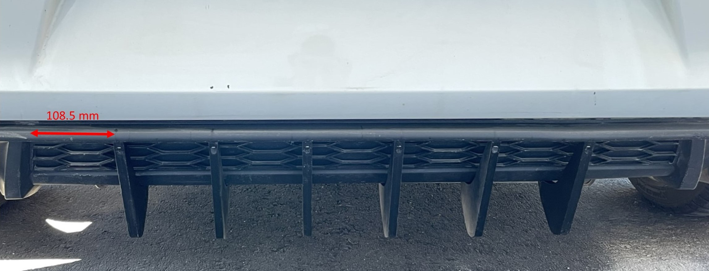

# VW MK7 GTI Aero Parts 

## Description 
3D printable aero parts for the VW MK7 GTI. Diffuser fins are currently avaialble, more parts will be added soon.

## 3D Printing & Installation Instructions

### **Diffuser Fins**

The following hardware is required to mount the fins:
- 6 x M3 x 25mm screws
- 6 x M3 x 16mm screws
- [3M molding tape](https://www.amazon.ca/gp/product/B000BO913C/ref=ppx_yo_dt_b_asin_title_o02_s00?ie=UTF8&psc=1)
- Philips head screwdriver that is atleast 5 mm long
- Ruler
- Marker

**Step 1:**

Print 6x diffuser fins using the file provided under `DiffuserFin/DiffuserFin.stl`. It is recommended to print using PETG since it has the best UV resistance properties and will not discolor. ABS can also be used.

Recommended print settings:
- 40 mm/s print speed
- 25% infill 
- Support off 

**Step 2:** 

Stick 3M tape on the side of each fin and remove any excess tape.

**Step 3:**

Clean the diffuser, making sure there is no debris or dust that can inhibit adhesion.

**Step 4:** 

Measure from the top corner of the diffuser and mark a point at 108.5 mm. From that point, mark 5 addition points incrementing by the same distance. These points will be used to align and equally space out the fins: 

**Step 5:**

Remove 3M tape from the fin and align it with the middle of the point created, making sure the fin is perpendicular to the ground. Repeat for the 5 other fins. 

**Step 6:**

Use the M3 x 16mm screws to screw the top of each fin into the diffuser. Then using the M3 x 25mm screw, screw the bottom of each fin.

**Step 7:** 

Verify that the fins fit well and are flush with the diffuser.